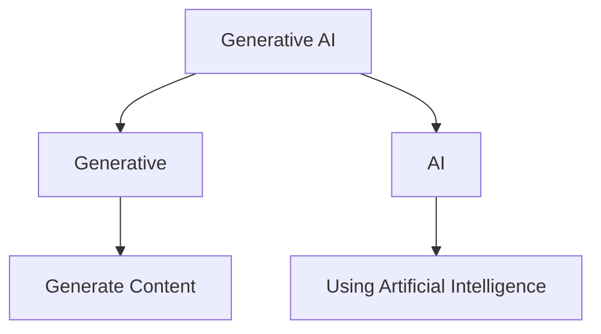

# Lecture 1: Concepts of Generative AI

## Generative Artificial Intelligence (AI)

**Generative artificial intelligence (AI)** describes algorithms that can be used to create new content, including audio, code, images, text, simulations, and videos.

### Visual Breakdown

---

## Reference

Kalota F. *A Primer on Generative Artificial Intelligence*[J]. Education Sciences, 2024, 14(2): 172.
